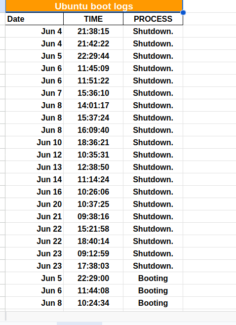

<h1>SysFilter</h1>

<h3>Short(ish) script to filter the syslog file that Ubuntu provides for boot, shutdown and sleep processes. After filtering, the desired logs are written to a Google Sheets sheet.</h3>

Stack

<ul>
<li>Python</li>
<li>Google API (Drive & Sheets)</li>
</ul>

<h2>Dependencies</h2>
<ul>
<li>gspread</li>
<li>oauth2client</li>
</ul>

<h2>Setup steps</h2>
<h4>Make sure to have a Google account with which to access and enable the API's</h4>
<ol>

<li>Create a virtual environment with Python by running <code>python -m venv <directory_name></code> or <code>python -m venv venv</code></li>
<li>Activate virtual environment with <code>source myvenv/bin/activate</code> in Linux or <code>venv\Scripts\activate.bat</code> in Windows cdm.</li>
<li>Run <code>pip install -r requirements.txt</code> to install dependencies.
</li>
<li>Go to Google Cloud Console --> API's & services --> Search for Google Drive API and Google Sheets API --> Enable both 
Note: without having Google Drive API, the Sheets API will not work.
</li>
<li>Go to credentials.</li>
<li>Add key/Create key --> Service account --> JSON file</li>
<li>Download JSON credentials file and move it to the root directory of your project.</li>
<li>Add key/Create key --> Service account --> JSON file</li>
<li>In the code replace the project values such as sheets name and keys with your projects ones. I reccomend you specify these in a <code>.env</code> file</li>
</ol>

<h4>Expected output result:</h4>
</img>

